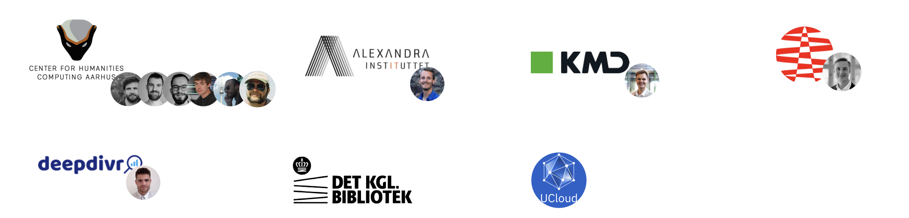

A collaborative project for training foundational Danish language model. Which seeks to:

- Develop and maintain **state-of-the-art models** for Danish, 
- which are **well-validated** across a wide range of tasks.
- Furthermore, we wish to **ensure good documentation**, which allows users to assess the model for their use-case critically
- **Open-source**, both model and source code

*Note*: This repository is intended for the text model of DFM.

## Progress

2022
- January: Project started
- June: We replicated the performance of the existing Danish BERT using BERT architecture on an DCC v1.0.0 (This model can be found at [chcaa/dfm-bert-base-v1](https://huggingface.co/chcaa/dfm-bert-base-v1?text=Paris+is+the+%5BMASK%5D+of+France.), you can find the model card [here](https://github.com/centre-for-humanities-computing/danish-foundation-models/blob/main/docs/model_card.md))
- October: Model trained started using the DeBERTaV2 architecture using the DCC v1.1.0
  which used the notably more filtered Netarkivet Text v2.

### Follow along:

|                                                                                                                    |                                                               |
| ------------------------------------------------------------------------------------------------------------------ | ------------------------------------------------------------- |
|🚀 [**Model training**](https://wandb.ai/chcaa/danish-foundation-models/reports/dfm-debertav2-v1--VmlldzoyODc3NTA5) | A weight and biases report of model training |
|🕵️‍♂️ [**Hyperparameters search**](https://wandb.ai/chcaa/danish-foundation-models/reports/Grid-Search-1--VmlldzoyODE5NDE5) | A weight and biases report of hyperparameters search |
|🛠️ [**Training Logs**](https://github.com/centre-for-humanities-computing/danish-foundation-models/blob/trainingv2/docs/logs_training_v2.md) | A markdown for noting the progress we went through during the training of the second iteration of models |

## Danish Collosal Corpus

We currently use the Danish Colossal Corpus (DCC) version 1.1.0 to train Danish Language models. DCC consists of the following datasets: 

| Dataset                                                                                                                                       | Description                                                              | Size in billion tokens (filtered) | Version |
| --------------------------------------------------------------------------------------------------------------------------------------------- | ------------------------------------------------------------------------ | --------------------------------- | ------- |
| 📚 [DAGW, Reddit](https://github.com/centre-for-humanities-computing/danish-foundation-models/blob/main/docs/dagw_reddit.md)                   | Danish Gigaword and Reddit. DAGW includes a wide coverage dataset | 0.83                              | v1      |
| 🐦 [HopeTwitter](https://github.com/centre-for-humanities-computing/danish-foundation-models/blob/main/docs/datasheets/hopetwitter.md)         | A dataset of tweets collected as a part of the HOPE project.             | 0.48                              | v1      |
| 📰 [DaNews](https://github.com/centre-for-humanities-computing/danish-foundation-models/blob/main/docs/datasheets/danews.md)                   | A dataset consisting of Danish newspapers                                | 8.67                              | v1      |
| 🌐 [Netarkivet Text](https://github.com/centre-for-humanities-computing/danish-foundation-models/blob/main/docs/datasheets/Netarkivet_text.md) | A subsection of the "Danish" internet collected the royal Danish library | >100                              | v2      |

# Contribution
## Wish to contribute?
DFM is considered a collaborative project for training and maintaining Danish Language models. If you wish to contribute don't hesitate to reach out using one of the following channels:

|                                                                                                                    |                                                               |
| ------------------------------------------------------------------------------------------------------------------ | ------------------------------------------------------------- |
|🗣 [**DDSC Slack**](https://join.slack.com/t/danskdatascie-o8m9638/shared_invite/zt-1jh2dwmj4-D_mjywfXERvVP75n9O0ykg) | Join the discussion in the "danish-foundation-models"-channel |
| 💬 [**GitHub Discussion**](https://github.com/centre-for-humanities-computing/danish-foundation-models/discussions) | Ask questions or start a discussion |
| 🚨 [**GitHub Issues**](https://github.com/centre-for-humanities-computing/danish-foundation-models/issues) | Notices a bug in the code? Please create an issue  |

You can contribute both:

-  Developer time, the lifeblood of any open-source project
-  Pre-training datasets you wish to include in the model training
-  Validation tasks can even be private benchmarks where you only wish to share the performance metrics.
- And probably in many other ways

## Current Contributors and Collaborators
This project has collaborators across industry, national institutions and research centers. This project uses compute resources supplied by [Ucloud](https://docs.cloud.sdu.dk/index.html) through the [DeiC e-infrastructure grant](https://www.deic.dk/en/supercomputing/Apply-for-HPC-resources).

