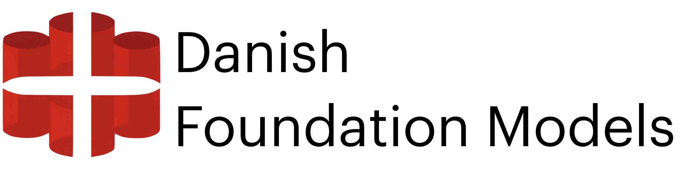

A collaborative project for training foundational Danish language model. Which seeks to:

- Develop and maintain **state-of-the-art models** for Danish, 
- which are **well-validated** across a wide range of tasks.
- Furthermore, we wish to **ensure good documentation**, which allows users to assess the model for their use-case critically
- **Open-source**, both model and source code

*Note*: This repository is intended for the text model of DFM.

### More information:
For more information please check out the following links:

|                                                                                                         |                                                                                                         |
| ------------------------------------------------------------------------------------------------------- | ------------------------------------------------------------------------------------------------------- |
| 📑 [**About**](https://centre-for-humanities-computing.github.io/danish-foundation-models/)              | A overview of the DFM project                                                                           |
| [**Research Paper**](https://arxiv.org/abs/2311.07264)                                                  | An paper introducing DFM and its rationale                                                              |
| 🚀 [**Models**](https://centre-for-humanities-computing.github.io/danish-foundation-models/models_text/) | A overview of current models available through the DFM project                                          |
| 💽 [**Datasets**](https://centre-for-humanities-computing.github.io/danish-foundation-models/dcc/)       | Includes datasheets about the datasets which includes preprocessing, reason for constructions and more. |

# Wish to contribute?
DFM is considered a collaborative project for training and maintaining Danish Language models. If you wish to contribute don't hesitate to reach out using one of the following channels:

|                                                                                                                      |                                                               |
| -------------------------------------------------------------------------------------------------------------------- | ------------------------------------------------------------- |
| 🗣 [**DDSC Slack**](https://join.slack.com/t/danskdatascie-o8m9638/shared_invite/zt-1jh2dwmj4-D_mjywfXERvVP75n9O0ykg) | Join the discussion in the "danish-foundation-models"-channel |
| 💬 [**GitHub Discussion**](https://github.com/centre-for-humanities-computing/danish-foundation-models/discussions)   | Ask questions or start a discussion                           |
| 🚨 [**GitHub Issues**](https://github.com/centre-for-humanities-computing/danish-foundation-models/issues)            | Notices a bug in the code? Please create an issue             |

You can contribute both:

-  Developer time, the lifeblood of any open-source project
-  Pre-training datasets you wish to include in the model training
-  Validation tasks can even be private benchmarks where you only wish to share the performance metrics.
- And probably in many other ways

# For Contributors
|                                                      |                                     |
| ---------------------------------------------------- | ----------------------------------- |
| 🗣 [**Adding a dataset**](/docs/Adding_a_new_dataset) | A guide on how to add a new dataset |
