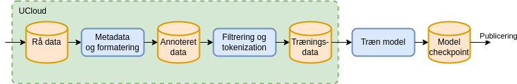
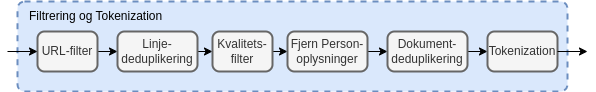

# Datahåndtering
For at kunne træne sprogmodeller (Large Language Models, LLM) skal der store mængder af data til. Fra vi modtager rådata til at de kan bruges til at træne sprogmodeller på, gennemgår de en transformationsprocess.

Følgende er en overordnet beskrivelse af denne processen. Vi udvikler og forbedre løbende processen, for at sikre at vi bruger state-pf-the-art metoder og praksis.

<!-- more -->
## Sikker håndtering 
I Danish Foundation Model bruger vi Danish e-infrastructure Consortium [DeiC](https://www.deic.dk/da/om-deic) og [UCloud](https://docs.cloud.sdu.dk/intro/security.html) til data håndtering. UCloud platformen er [ISO27001](https://www.iso.org/standard/27001) godkendt. Det er globalt anerkendt standard, der sikrer at vores datahåndteringspraksis opfylder strenge internationale kriterier. For mere information om vores sikkerhedsforanstaltninger, se UClouds [sikkerhedsdokumentation](https://docs.cloud.sdu.dk/intro/security.html).

## Dataklargørelse
Alt dataklargørelse foregår på UCloud. Figuren viser den proces alt data skal igennem før det bruges til træning af sprogmodellen. Det rå data beholdes i sin oprindelige form på UCloud. Derefter annoteres de rå data med metadata.

Dette datasæt overføres til en GPU-accelereret supercomputer igennem en sikker forbindelse, hvorefter selve træningen af modellen begyndes. Under træningen gemmes flere checkpoints med modelvægte. De gemte checkpoints med modelvægte publiceres sammen med modelkode og anvendes til at køre modellen. De tre processer er beskrevet i detalje nedenfor.



## Metadata og formatering
Det rå data annoteres med to typer af metadata. Den første type er et datablad (i Markdown, som i [HuggingFace dataset cards](https://huggingface.co/docs/hub/en/datasets-cards) der opsummerer hele datasættet og beskriver bl.a. proveniens og hvilken licens der er pålagt det givne datasæt. Et udsnit af et databladseksempel er vist nedenfor. Den første del af databladet er annoteret i et maskinvenligt format, som gør det muligt automatisk at udvælge datasættet blandt en større samling. Resten af databladet giver en dybere beskrivelse af datasættet i fritekst.

```markdown
---
pretty_name:  Scrape from Hovedstaden
language:
  - da
license: cc0-1.0
license_name: Creative Commons Zero v1.0 Universal
size_categories:
  - 10K<n<100K
task_categories:
  - text-generation
  - fill-mask
task_ids:
  - language-modeling
---
# Dataset Card for scape_hovedstaden
## Dataset Description
- **Number of records:** 24752
- **Languages:** Danish
```

Den anden type af metadata er per-dokument metadata, der beskriver hvilket datasæt dokumentet hører til, hvor det stammer fra, hvornår det er tilføjet, samt andre metadata som f.eks. fra hvilken URL dokumentet kommer fra. Per-dokument metadata gemmes sammen med dokumentet i et standardiseret jsonl format. Et eksempel på et enkelt dokument inklusiv metadata fra datasættet "Scrape from Hovedstaden" er vist nedenfor. Disse metadata følger dokumentet igennem hele processeringen, så det er muligt at spore dokumenterne tilbage til kilden fra det endelige træningskorpus. For hvert rå datasæt vedligeholdes et script der kan bruges til konvertering af de rå data til det standardiserede format.

```yaml
{
    'id': 'doc_hovedstaden_Rigshospitalet_BedЫvelse og Intensiv Behandling (NEU)_Transkraniel Doppler - NIA 6021',
    'text': 'Transkraniel Doppler - NIA 6021\n\nMålgrupper og anv...',
    'source': 'scrape_hovedstaden',
    'added': '2024-05-23',
    'created': '2023-11-16, 2024-04-04',
    'metadata': {
        'subject': 'health',
        'language': 'danish',
        'organization': 'The Danish Agency for Digitalisation',
        'source-pretty': 'University of Southern Denmark (SDU) & Capital Region',
        'URL': 'https://sprogteknologi.dk/dataset/1076892a-14ee-4f14-a9db-32efb03c40c9'
    }
}
```

Flere detaljer om formatet er beskrevet [her](https://github.com/centre-for-humanities-computing/danish-foundation-models/blob/main/docs/Adding_a_new_dataset).

## Filtrering

Det standardiserede format muliggør en ensartet processering af dokumenterne. De enkelte filtreringstrin kan inddeles i følgende kategorier:
 - URL-filter (kun for web-data)
 - Linje-deduplikering
 - Kvalitetsfilter
 - Fjernelse af personoplysninger
 - Dokument-deduplikering

De enkelte trin er beskrevet i nedenstående afsnit. Efter filtreringstrinene bliver vores tekstdata tokenized, dvs. konverteret til et binært format der kan læses af modellen.



### URL-filtrering

Data som kommer fra offentlige hjemmesider og dermed har en URL som metadata, bliver først processeret af et URL-filter.

For alle domæner i datasættet hentes domænets robots.txt og ai.txt periodisk. Hvis disse ikke tillader CommonCrawl eller andre sprogmodel-crawlers tilføjes domænet til en blokeringsliste og dokumenter der stammer fra disse domæner filtreres væk, selv om de pågældende sider måtte være hentet på et tidspunkt, hvor robots.txt/ai.txt ikke blokerede for denne type for crawling.

Derudover anvendes blokeringslister fra forskellige offentligt tilgængelige databaser over skadeligt indhold. Vi bruger [datatrove's indbyggede filter](https://github.com/huggingface/datatrove/blob/main/src/datatrove/pipeline/filters/url_filter.py) samt [Dolma's samling af blokeringslister](https://github.com/allenai/dolma/blob/main/python/dolma/taggers/url.py). Disse lister omfatter bl.a. følgende kategorier:

 - Porno (både via lister og via ord der indgår i domæne-navnet)
 - Phishing
 - Reklamer
 - Kriminelle sider
 - Abuse
 - Fraud
 - Malware
 - Pirat
 - Ransomware
 - Scam
 - Redirect
 - Crypto
 - Drugs
 - Gambling
 - Vaping
 - Social Networks

### Deduplikering

Deduplikering anvendes til at fjerne gentagelser. Gentagelser i træningsdata kan påvirke modellen i en uønsket retning. Der anvendes to typer af deduplikering linje-deduplikering og dokument-deduplikering

Linje-deduplikering er en proces hvor gentagne linjer fjernes på tværs af dokumenter. Dette er især anvendeligt på web-data, hvor f.eks. cookie notifikationer og menuer gentages på tværs af mange sider. Denne type af deduplikering implementeres effektivt vha. et såkaldt Bloom filter. Visse typer af datasæt kan med fordel fritages for linje-deduplikering. F.eks. vil der i juridiske dokumenter ofte indgå en række standard formuleringer og deduplikering af disse kan ødelægge dokumenternes betydning.

I dokument-deduplikering sammenlignes alle dokumenter på tværs af det rensede dokumentkorpus og dokumenter der indholdsmæssigt er tilpas tæt på hinanden grupperes i en klynge. Fra hver klynge udtrækkes ét enkelt dokument. På den måde undgås at visse dokumenter bliver overrepræsenteret i det endelige datasæt. 

### Kvalitetsfilter

Web-data kan indeholde meget støj i form af stumper af HTML eller andet kode og ufuldstændige sætninger. Der anvendes forskellige heuristikker, som er baseret på statistik for almindelig tekst, der fanger disse dokumenter af dårlig kvalitet. Vi bruger p.t. samme filtre som Gopher og C4, men der undersøges også mulighed for filtrering baseret på perpleksitet og andre metrikker.

### Personhenførbar Information

Når en model trænes på data, som indeholder personhenførbar information, medfører det en risiko for at modellen reproducerer denne information under kørsler. Så vidt det er muligt detekteres disse kategorier og erstattes med generiske erstatninger af samme type. Eksempler på personhenførbar information er: Navne, e-mails, telefonnumre, CPR-numre.

En udfordring er at hverken menneskelig eller maskinel fjernelse af personhenførbar information er 100% nøjagtigt, så datasæt uden disse er at foretrække. 

## Dialog om data

Vi har den største respekt for dem, der ejer data. Vi forstår, hvor vigtigt det er at beskytte og respektere dataejeres ønsker om hvad og hvordan deres data må bruges til. 

Hvis du har nogen spørgsmål vedrørende de data vi bruger, er du altid velkommen til at kontakte os. Vi er meget åbne for dialog og sætter pris på input, da det hjælper os med at forbedre vores praksis og sikre, at vi lever op til dataejeres ønsker. 

Din feedback er vigtig for os, og vi ser frem til at høre fra dig.
